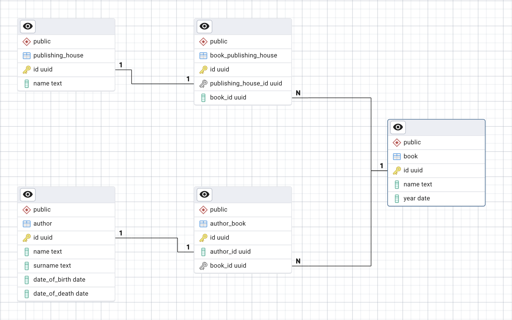

# Books-market

# Окружение

Для запуска использовать:
```sh
make start
```

Для остановки:
```sh
make stop
```

Для работы в браузере зайдите на `http://localhost:8080`
```
mail: admin@admin.com
pwd: admin
```

# Цель

Цель - сделать рабочую базу данных для торговли книгами.
Схема v1:


### Задание 1
Создать таблицу `auther` и сохранить код в `src/schema.sql`

### Задание 2
Создать остальные таблицы

### Задание 3
Создать остальные таблицы

### Задание 4
Создать ключи между таблицами